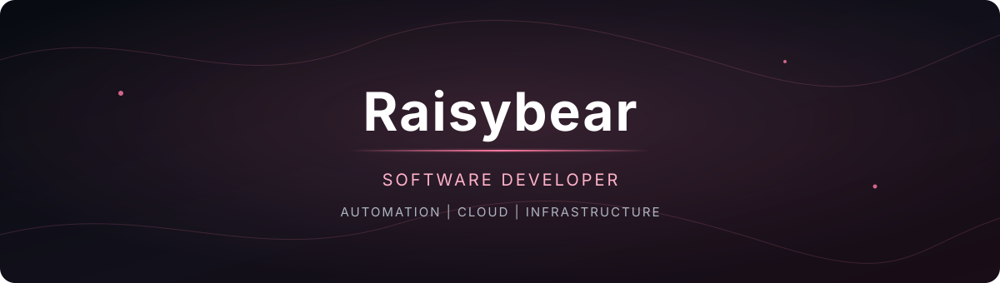

<!-- GitHub profile README for github.com/Raisybear -->

  

   

  <a href="https://raisybear.net/"><strong>raisybear.net</strong></a>
  &nbsp;&nbsp;|&nbsp;&nbsp;
  <a href="https://github.com/Raisybear?tab=repositories">Projects</a>
  &nbsp;&nbsp;|&nbsp;&nbsp;
  <a href="https://github.com/Raisybear?tab=followers">Followers</a>

## About

I'm a developer focused on **C#/.NET**, web and mobile software, and automation. I enjoy taking ideas from code and data through deployment and infrastructure, while continuing to explore AI workflows, systems, networks, and game development.

  

## Selected Projects

| Project | Description | Stack |
|:--|:--|:--:|
| [YourMakro](https://github.com/Raisybear/YourMakro) | Advanced mouse automation tool with cloud sync — current project |   |
| [ASCIISnakeGame](https://github.com/Raisybear/ASCIISnakeGame) | Classic Snake game with ASCII graphics |   |
| [LA1304RPG](https://github.com/Raisybear/LA1304RPG) | Text-based RPG game with character progression |   |
| [Hauptprojekt_Kontenfuehrung](https://github.com/Raisybear/Hauptprojekt_Kontenfuehrung) | Full-stack account management system |      |
| [PasswortGenerator](https://github.com/Raisybear/PasswortGenerator) | Secure password generator with customization |   |

  

## Technologies

<h3 align="center">Languages and Web</h3>

  
  &nbsp;&nbsp;
  
  &nbsp;&nbsp;
  
  &nbsp;&nbsp;
  
  &nbsp;&nbsp;
  
  &nbsp;&nbsp;
  
  &nbsp;&nbsp;
  
  &nbsp;&nbsp;
  

<h3 align="center">Frameworks and Data</h3>

  
  &nbsp;&nbsp;
  
  &nbsp;&nbsp;
  
  &nbsp;&nbsp;
  
  &nbsp;&nbsp;
  
  &nbsp;&nbsp;
  

<h3 align="center">Cloud and DevOps</h3>

  
  &nbsp;&nbsp;
  
  &nbsp;&nbsp;
  
  &nbsp;&nbsp;
  
  &nbsp;&nbsp;
  
  &nbsp;&nbsp;
  
  &nbsp;&nbsp;
  

<h3 align="center">Tools and Platforms</h3>

  
  &nbsp;&nbsp;
  
  &nbsp;&nbsp;
  
  &nbsp;&nbsp;
  
  &nbsp;&nbsp;
  
  &nbsp;&nbsp;
  
  &nbsp;&nbsp;
  
  &nbsp;&nbsp;
  
    
  
  &nbsp;&nbsp;
  
  &nbsp;&nbsp;
  
  &nbsp;&nbsp;
  
  &nbsp;&nbsp;
  

  

## GitHub Activity

  
  
   
  

  
  <a href="https://raisybear.net/"><strong>raisybear.net</strong></a>
    

