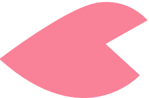
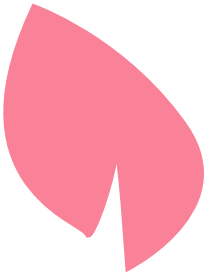

<!-- Animiertes GIF als dekorativer Header -->

  

<!-- Weitere schwebende Blütenblätter -->

  
  
  
  

<!-- Hauptheader -->
<h1 align="center">
   
  💋 Hi there, I'm Raisybear! 
  
</h1>

<!-- Badges mit dekorativen Elementen -->

  
  
  
  

<!-- Beschreibung mit Rahmen aus Blütenblättern -->

  
  <em>I'm a passionate developer specializing in C#/.NET and web technologies, scripting is also very fun. Welcome to my GitHub profile!</em>
  

<!-- Dekorative Trennlinie -->

  
  
  
  
  

## My Website

  
  
  

<!-- Weitere dekorative Elemente -->

  
  
  

## Featured Projects

<!-- Projekte-Tabelle bleibt gleich, aber mit dekorativen Rahmen -->

  
  

| Project | Description | Technologies | Environment |
|---------|-------------|--------------|-------------|
| [YourMakro ⭐](https://github.com/Raisybear/YourMakro) | Advanced mouse automation tool with cloud sync (Current Project) |    |  |
| [ASCIISnakeGame](https://github.com/Raisybear/ASCIISnakeGame) | Classic Snake game with ASCII graphics |   |  |
| [LA1304RPG](https://github.com/Raisybear/LA1304RPG) | Text-based RPG game with character progression |   |  |
| [Hauptprojekt_Kontenfuehrung](https://github.com/Raisybear/Hauptprojekt_Kontenfuehrung) | Full-stack account management system |      |   |
| [PasswortGenerator](https://github.com/Raisybear/PasswortGenerator) | Secure password generator with customization |   |  |

<!-- Dekorative Blütenblatt-Trennlinie -->

  
  
  
  

## Technologies & Tools

  
  <strong>Programming Languages</strong>
  

  
  <strong>Frameworks & Libraries</strong>
  

  
  <strong>Development Environments</strong>
  

  
  <strong>DevOps & Tools</strong>
  

<!-- Weitere Trennlinie mit GIF -->

  

<!-- Große dekorative Blütenblatt-Formation -->

  
  
  
  
  
  >

## GitHub Stats

<!-- Stats mit dekorativen Blütenblättern umrahmt -->

  
  

  

  
  

<!-- Abschluss mit schöner Blütenblatt-Formation -->

  
  
  
  
  

---

  
  ⭐️ From [Raisybear](https://github.com/Raisybear)
  

<!-- Schwebende Blütenblätter am Ende -->

  
  
  

